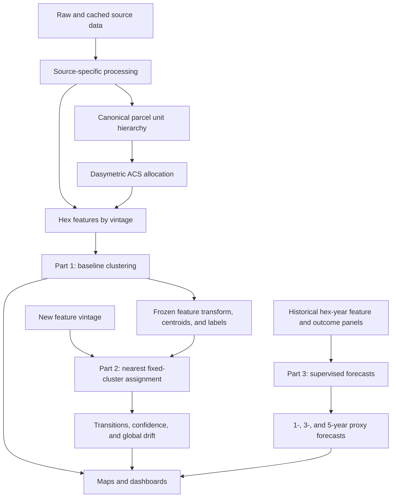

# Analytical Workflow

The pipeline follows the proposed methods report directly.

## Shared Data Layer

Each source processor has one substantive responsibility and writes a durable
artifact. `_targets.R` is the only canonical orchestrator. The former
`02_process_data.R` script is archived because it mixed transformations,
dependency management, API behavior, and joins in one execution environment.

The current feature surface combines:

- displacement proxies: rent, residential demolitions, eviction filings, and
  appraisal value pressure;
- vulnerability: income, poverty, tenure, race/ethnicity, education, and rent
  burden;
- smoke signals: 311 activity, corporate ownership, transactions, and amenity
  change;
- denominators and coverage indicators needed to distinguish zero from missing.

Time-indexed features must retain their observation cutoff and source vintage.
No Part 3 predictor may contain information published after the forecast origin.

## Part 1

The current implementation evaluates the baseline and amenity-augmented
k-means specifications for multiple values of `k`, including silhouette, gap,
and repeated-subsample stability diagnostics. Six clusters are the current
substantive selection.

The frozen model artifact stores all transformations needed for later updates.
This is essential: preserving centroids while recomputing standardization on a
new year would still redefine the groups.

## Part 2

For a new vintage:

1. Build the same named features with the new cutoff.
2. Apply the baseline means and standard deviations.
3. Assign each complete hex to the nearest frozen centroid.
4. Calculate distance to the chosen centroid and margin from the second-nearest
   centroid.
5. Flag boundary cases and observations outside their cluster's baseline
   distance envelope.
6. Compare assignments with the preceding vintage.
7. Monitor the citywide share of low-confidence assignments for data drift.

The baseline self-assignment target must reproduce Part 1 exactly before future
vintages are accepted.

## Part 3

Predictors at time `T` consist of prior smoke signals, vulnerability, existing
proxy pressure and trends, and spatial context. Outcomes are future observed:

- eviction filings;
- residential demolitions;
- inflation-adjusted rent growth;
- county-adjusted real land-value growth.

The outcomes are modeled separately at 1-, 3-, and 5-year horizons before being
translated into a policy-facing future concern classification. Validation uses
historical backtesting, with false-negative performance reported explicitly.

`config/forecast_outcomes.csv` is the machine-readable outcome contract.
`output/part3/forecast_readiness.csv` shows which historical panels remain
incomplete.
