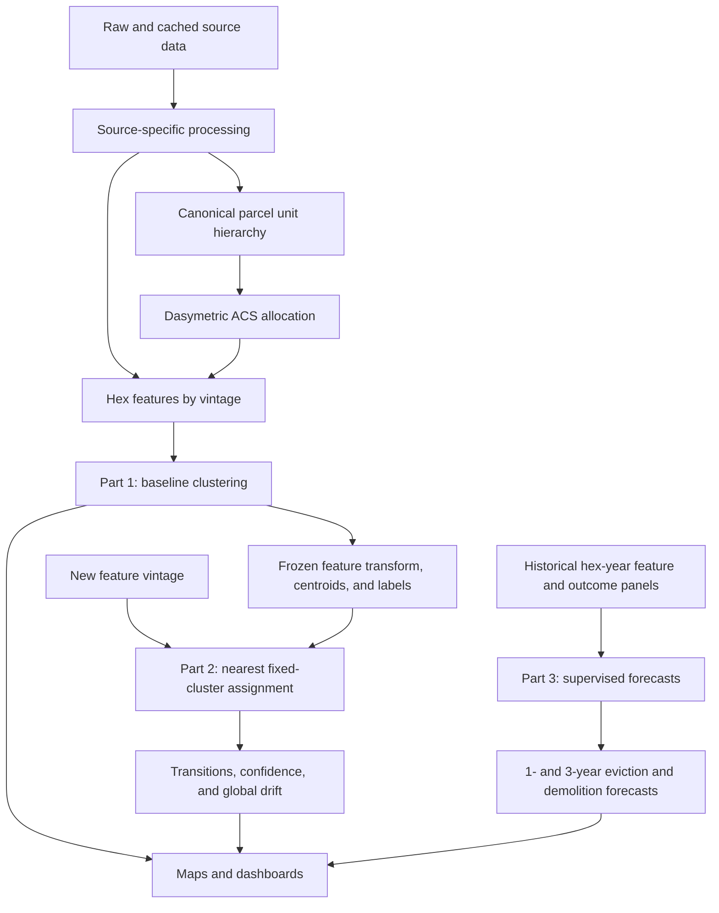

# Analytical Workflow

The pipeline follows the proposed methods report directly.

## Shared Data Layer

Each source processor has one substantive responsibility and writes a durable
artifact. `_targets.R` is the only canonical orchestrator. The former
`02_process_data.R` script is archived because it mixed transformations,
dependency management, API behavior, and joins in one execution environment.

The current feature surface combines:

- displacement proxies: rent, residential demolitions, eviction filings, and
  appraisal value pressure;
- vulnerability: income, poverty, tenure, race/ethnicity, education, and rent
  burden;
- smoke signals: configured code-enforcement 311 intake, corporate ownership,
  transactions, and amenity change;
- denominators and coverage indicators needed to distinguish zero from missing.

The 7,027-cell H3 surface is the common computational grid generated from the
2021 Census Austin place polygon. Part 3 uses a fixed study subset of 6,060
cells whose projected point-on-surface falls inside the exact April 29, 2026
City of Austin FULL polygon. Retaining the larger grid supports Part 1, Part 2,
and boundary diagnostics without treating all grid cells as eligible Part 3
locations.

Time-indexed features must retain their observation cutoff and source vintage.
No Part 3 predictor may contain information published after the forecast origin.

## Part 1

The current implementation evaluates the baseline and amenity-augmented
k-means specifications for multiple values of `k`, including silhouette, gap,
and repeated-subsample stability diagnostics. Seven clusters are the current
substantive selection.

Spatially blocked model-selection and other expensive sensitivity checks are
run separately through `_targets_review.R`. They support an explicit
re-baseline decision but are not dependencies of routine production runs.

The frozen model artifact stores all transformations needed for later updates.
This is essential: preserving centroids while recomputing standardization on a
new year would still redefine the groups.

## Part 2

For a new vintage:

1. Build the same named features with the new cutoff.
2. Apply the baseline means and standard deviations.
3. Assign each complete hex to the nearest frozen centroid.
4. Calculate distance to the chosen centroid and margin from the second-nearest
   centroid.
5. Flag boundary cases and observations outside their cluster's baseline
   distance envelope.
6. Compare assignments with the preceding vintage.
7. Monitor the citywide share of low-confidence assignments for data drift.

For operational updates of Part1, baseline self-assignment must reproduce that
model exactly. The separate retrospective Part2 proof of concept instead fits
its own April2025 baseline on the common covered sample and checks that
baseline's self-assignment. It uses complete fixed component recipes at both
dates, a six-vintage reliability-based BG/tract rent hierarchy, and signed
eviction/311 rate changes. See [historical methods](historical-cluster-comparison.md)
and the [current results](../audits/part2-cluster-comparison-2026-09.md).

## Part 3

Predictors at time `T` consist of prior smoke signals, vulnerability, existing
proxy pressure and trends, and spatial context. The initial pilot has four
distinct future outputs:

- eviction filings within 1 year;
- eviction filings within 3 years;
- residential demolitions within 1 year; and
- residential demolitions within 3 years.

The pilot compares separate outcome-by-horizon models with a joint multi-task,
multi-horizon candidate. The joint candidate may share relationships across
tasks, but it must retain four outcome-specific predictions rather than
collapsing evictions and demolitions into a composite label. It advances only
if historical backtesting shows that sharing information improves at least one
output without materially degrading another. False-negative performance and
calibration are reported for each output.

For the annual pilot, the forecast origin is December 31 of year `T`. The
1-year label counts events during calendar year `T + 1`; the 3-year label sums
events from `T + 1` through `T + 3`. Evictions are unique filed cases, regardless
of later disposition, and demolitions are unique issued residential-demolition
permits. Counts are retained as the modeling outcomes; historical occupied
rental units and residential units will supply task-specific exposure measures
when the predictor panel is built.

Outcome coverage is indexed to time within the fixed current-full study
geography. Williamson addresses pass through a cached local public-address
match, City of Austin public ArcGIS locator, U.S. Census Bureau batch geocoder,
and targeted ArcGIS World refinement. The external stages transmit only an
opaque address ID and cleaned address string; address-bearing caches and review
artifacts remain in ignored `output/` paths. The authenticated World stage
revisits only City-relevant unresolved or Census-interpolated records and is an
active offline-cache dependency of the Part 3 panel. A reliable filing point
must fall inside the exact current FULL polygon as well as its source county and
effective court geography; sharing an H3 cell with the City is not sufficient.

Eviction source coverage uses the versioned 2024 Census county assignment plus
the official Williamson precinct map applicable in each period. Travis JP1-JP5
cover the 5,711 current-full Travis cells. Of 295 current-full Williamson cells,
the supplied court periods cover 128 in 2020-2021 and 266 from 2022 onward; the
29 cells assigned to current JP3 remain missing. All 54 Hays cells also remain
missing. Candidate hex-years are unavailable when a case has multiple plausible
in-source hexes or mixed in-source/out-of-source addresses.

Demolition source coverage is reconstructed by replaying effective-dated City
jurisdiction baselines and actions from the first day of each observed annual
interval through its December 31 cutoff, capped at the source's observed-through
date. The interval is covered only if every state is resolved as FULL, LTD, or
2MILE; midyear entry into coverage, ambiguous, unsupported, and unresolved
states remain explicit so they cannot be mistaken for full-year zero events.
The historical replay establishes whether the City permit source covered a
selected cell-year; it does not change the fixed prediction geography.

Using the April 29, 2026 FULL polygon for every year produces a retrospective
history for today's City footprint. It does not reconstruct whether a location
was legally inside Austin on its filing or permit date. A contemporaneous-city-
limits analysis would require a different, explicitly time-varying study
geography.

Rent growth and county-adjusted real land-value growth remain possible later
outcomes, but they are deferred until the eviction and demolition pilot is
evaluated. Five-year forecasts are outside the pilot scope. Outcome availability
is explicit: an unavailable label is missing, while zero means that the source
covered the hex and period and observed no event.

`config/forecast_outcomes.csv` is the machine-readable outcome contract.
`output/part3/forecast_readiness.csv` validates the pilot outcome panels and
labels and reports the historical predictor panel as the next incomplete
dependency. A complete label window is not, by itself, a model-ready backtest
origin: all predictors must also exist as of that origin.
